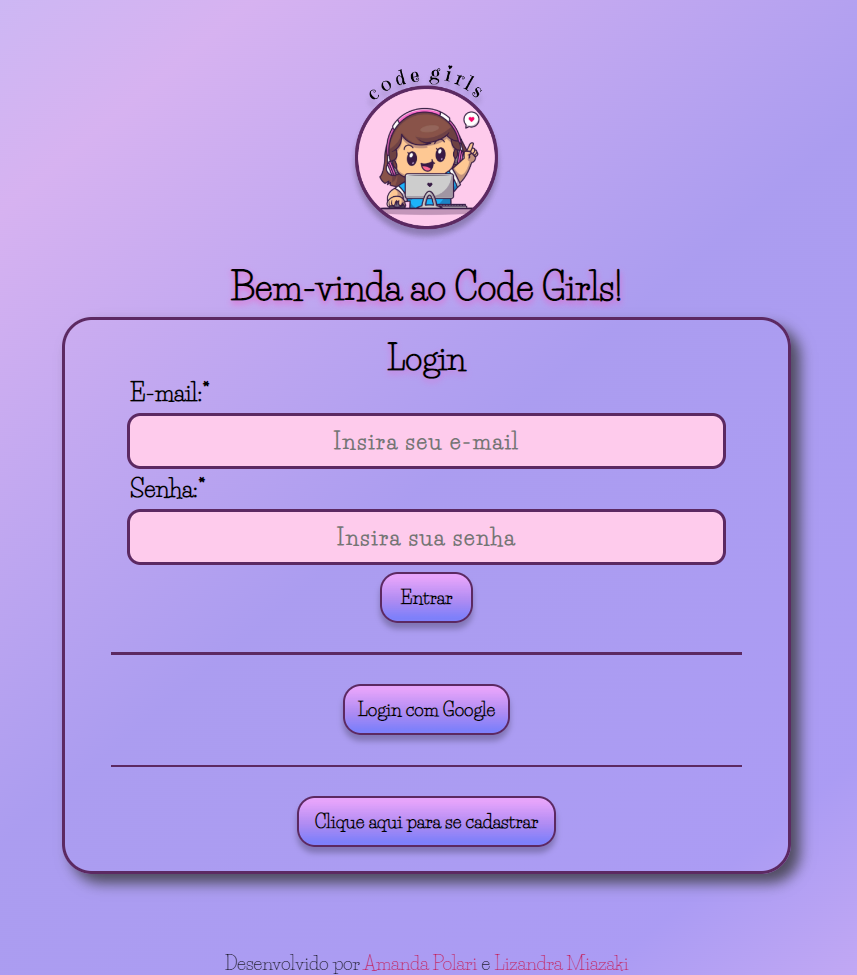
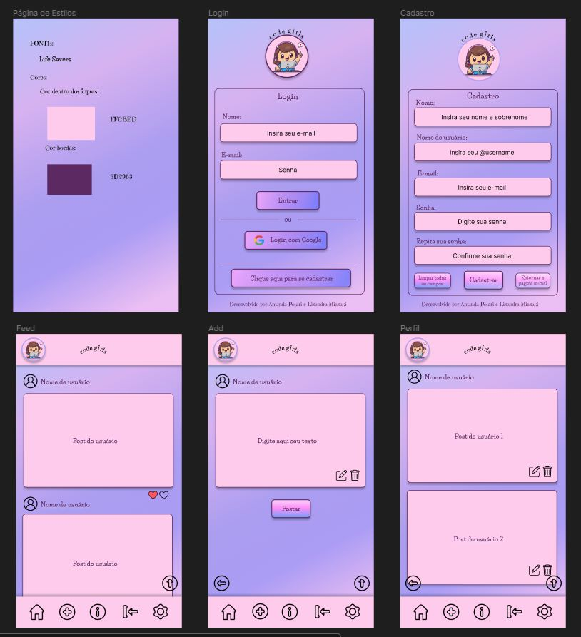

# Code Girls

## [Link do deploy](https://lizandrafmiazaki.github.io/SAP008-social-network/)

***

## Índice

* [1. Resumo do Projeto](#1-resumo-do-projeto)
* [2. Definição de produto](#2-definição-de-produto)
* [3. História do usuário](#3-história-do-usuário)
* [4. Instalações](#4-instalações)
* [5. Iniciando](#5-iniciando)
* [6. Como testar](#6-como-testar)
* [7. Tecnologias utilizadas](#7-tecnologias-utilizadas)
* [8. Desenho de interface do usuário](#8-desenho-de-interface-do-usuário)

***

## 1. Resumo do Projeto



O **Projeto Social Network** foi o terceiro projeto desenvolvido no *bootcamp da Laboratória*. Uma Rede Social que permite que o usuário crie uma conta de acesso, logue-se com ela, crie, edite, delete e dê likes em publicações. 
O objetivo principal de aprendizagem deste projeto foi construir uma Single-page Application (SPA) responsiva, trabalhar com autenticação com Firebase Auth e persistência de dados com Firestore.

## 2. Definição de produto

O [**Code Girls**](https://lizandrafmiazaki.github.io/SAP008-social-network/) é uma rede social de compartilhamento de dicas de programação e tecnologia para mulheres.

A página de login oferece as usuárias duas formas para entrar em suas contas: *login com e-mail e senha* ou *login com o Google*. Esta página oferece ainda a opção de *cadastro* caso a usuária ainda não possua uma conta. 

Caso haja um problema ao realizar o login, o site também informa, de forma amigável, qual foi o seu erro e uma sugestão de correção. Sendo possível também, verificar se a usuária já possui ou não conta existente.

Depois de logada, a usuária poderá ler e curtir os posts já existentes, bem como poderá criar seu próprio post, além de editá-lo e excluí-lo. 

Para facilitar a navegação da usuária, a página de cadastro contém um botão de *'Limpar todos os campos'* que limpa todos os dados inseridos para o cadastro e um botão que retorna a página inicial. Já na página que contém os posts há um botão *'Topo'*, para retorna para o topo da página.


***
## 3. História do Usuário
### História 1

**Como** uma pessoa curiosa, **quero** me cadastrar **para** conhecer a plataforma.

### História 2

**Como** uma pessoa que já tem cadastro, **quero** fazer o login com e-mail e senha **para** entrar na plataforma.

### História 3

**Como** uma pessoa que já tem cadastro, **quero** fazer o login com Google **para** entrar na plataforma.

### História 4

**Como** uma pessoa que **deseja** compartilhar informações sobre tecnologia, **quero** criar, editar e excluir meus próprios posts.

### História 5

**Como** uma pessoa que **deseja** ver informações sobre tecnologia, **quero** visualizar essas informações e poder dar like.

## 4. Instalações

### Ter instalado:
* node
* npm

***

## 5. Iniciando
* Para instalar as dependências no diretório do seu projeto execute:

```
npm install
```
* Para iniciar o aplicativo execute:
```
npm start
```

***

## 6. Como testar
* Para executar os testes, execute:
```
npm run test
```

***

## 7. Tecnologias utilizadas
Esse programa foi construído com:
* HTML;
* CSS;
* JavaScript;
* Firebase;
* Figma.

***

## 8. Desenho de interface do usuário

O prototótipo de alta fidelidade foi feito utilizando Figma.

### Protótipo de alta fidelidade:


***

### Este projeto foi desenvolvido por:
* **Amanda Polari** : [Linkedin](https://www.linkedin.com/in/amandapolari/) | [GitHub](https://github.com/amandapolari)
* **Lizandra Miazaki** : [Linkedin](https://www.linkedin.com/in/lizandramiazaki/) | [GitHub](https://github.com/lizandrafmiazaki)